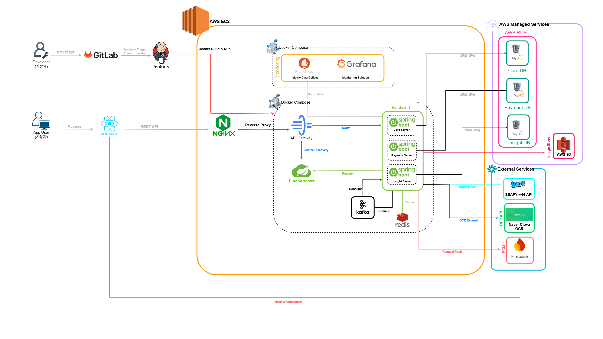

# DuckChi Project

## 소개

DuckChi는 마이크로서비스 아키텍처를 기반으로 한 금융 관리 모바일 애플리케이션입니다. 사용자 인증, 결제 처리, 데이터 인사이트, 알림 기능을 제공합니다.

## 기능

- **사용자 인증 및 관리**: JWT 기반 인증, Firebase 통합
- **결제 서비스**: 안전한 결제 처리
- **데이터 인사이트**: 사용자 데이터 분석 및 시각화
- **알림 시스템**: 실시간 푸시 알림
- **은행 연동**: 계좌 정보 조회 및 관리

## 시스템 아키텍처



DuckChi 아키텍처는 다음과 같이 구성됩니다.

- 개발자는 **GitLab**에 코드를 푸시하고, **Jenkins**가 웹훅 트리거를 통해 **AWS EC2**에서 Docker 이미지를 빌드 및 배포합니다.
- **Nginx**가 리버스 프록시 역할을 하며, 외부 요청을 **API Gateway**로 전달합니다.
- 백엔드는 **Eureka** 서비스 디스커버리를 통해 마이크로서비스를 등록하고 라우팅합니다.
- 주요 마이크로서비스:
  - **Core Service**: 인증, 사용자 관리, 알림 처리
  - **Pay Service**: 결제 트랜잭션 처리
  - **Insight Service**: 데이터 분석 및 인사이트 제공
- 메시징과 비동기 처리에는 **Kafka**를 사용하며, 캐시는 **Redis**로 처리합니다.
- 데이터 저장소는 **AWS RDS(MySQL)**의 Core DB, Payment DB, Insight DB로 분리되어 있습니다.
- 정적 파일과 이미지 저장은 **AWS S3**를 사용합니다.
- 외부 서비스 연동:
  - **SSAFY 금융 API**
  - **Naver Clova OCR**
  - **Firebase FCM** 푸시 알림
- 모바일 앱은 **React Native** 기반으로 구현되어 있으며, REST API를 통해 백엔드와 통신합니다.
- 모니터링은 **Prometheus**로 수집하고, **Grafana**를 통해 시각화합니다.

### 마이크로서비스 구성

- **Discovery Service**: Eureka 기반 서비스 디스커버리
- **Gateway Service**: API 게이트웨이 및 라우팅
- **Core Service**: 인증, 알림, 사용자 관리
- **Pay Service**: 결제 처리
- **Insight Service**: 데이터 분석 및 인사이트 제공

### 기술 스택

#### 백엔드
- **언어**: Java 17
- **프레임워크**: Spring Boot 3.5.11
- **마이크로서비스**: Spring Cloud (Eureka, OpenFeign)
- **데이터베이스**: JPA, Redis
- **메시징**: Kafka
- **클라우드**: AWS S3, Firebase
- **보안**: JWT
- **모니터링**: Prometheus, Actuator

#### 프론트엔드
- **프레임워크**: React Native, Expo
- **상태 관리**: Zustand
- **네트워킹**: Axios
- **알림**: Firebase Messaging, Notifee
- **저장소**: AsyncStorage

#### 인프라
- **컨테이너화**: Docker, Docker Compose
- **CI/CD**: Jenkins
- **모니터링**: Prometheus

## 설치 및 실행

### 사전 요구사항

- Java 17
- Node.js 18+
- Docker & Docker Compose
- Android Studio (안드로이드 개발용)
- Xcode (iOS 개발용)

### 백엔드 실행

1. 프로젝트 루트로 이동:
   ```bash
   cd DOCK-BE
   ```

2. 각 서비스 빌드:
   ```bash
   ./gradlew build
   ```

3. 로컬 환경 실행:
   ```bash
   docker-compose -f ../docker-compose.local.yml up -d
   ```

### 프론트엔드 실행

1. 프론트엔드 디렉토리로 이동:
   ```bash
   cd DOCK-FE
   ```

2. 의존성 설치:
   ```bash
   npm install
   ```

3. Expo 시작:
   ```bash
   npm start
   ```

4. 안드로이드 실행:
   ```bash
   npm run android
   ```

5. iOS 실행:
   ```bash
   npm run ios
   ```

### 프로덕션 배포

Jenkins 파이프라인을 통해 자동 배포됩니다.

## API 문서

Swagger UI를 통해 API 문서를 확인할 수 있습니다:
- Core Service: http://localhost:8081/swagger-ui.html
- 기타 서비스 포트 확인 필요

## 기여

1. Fork the repository
2. Create your feature branch (`git checkout -b feature/AmazingFeature`)
3. Commit your changes (`git commit -m 'Add some AmazingFeature'`)
4. Push to the branch (`git push origin feature/AmazingFeature`)
5. Open a Pull Request

## 라이선스

This project is licensed under the MIT License - see the [LICENSE](LICENSE) file for details.
